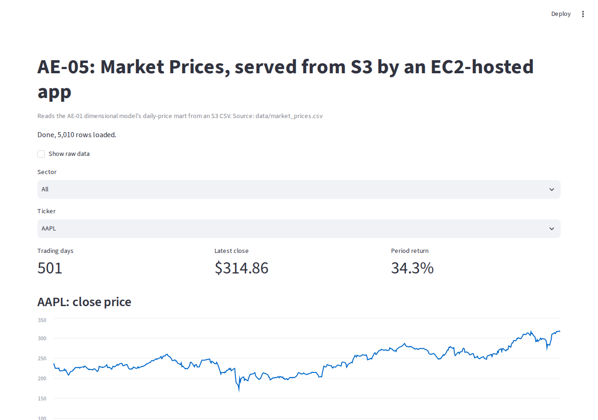

# ☁️ AWS Cloud Foundations: dbt Docs on S3 + a Streamlit Dashboard on EC2

> Two small, real AWS deployments instead of one tutorial repeated: a static website bucket
> serving the **AE-01 dbt docs site**, and an EC2 instance running a **Streamlit dashboard** that
> reads AE-01's market-price mart from S3 through a least-privilege IAM role. Infrastructure is
> Terraform, not console clicks.

**Status: 🚧 In progress.** The application code, IaC, and data pipeline are built and verified
locally (see [Results](#-results) and [`development.md`](development.md)). The AWS deploy itself is
a manual handoff, documented step by step in [`docs/aws_deploy_handoff.md`](docs/aws_deploy_handoff.md),
since this environment has no AWS credentials for a personal account.

---

## 📋 Table of Contents

- [Context](#-context)
- [Business Problem](#-business-problem)
- [Architecture](#️-architecture)
- [Data](#️-data)
- [Methodology](#-methodology)
- [Design Decisions](#-design-decisions)
- [Results](#-results)
- [Tech Stack](#️-tech-stack)
- [Repository Structure](#-repository-structure)
- [How to Reproduce](#️-how-to-reproduce)
- [Attribution](#-attribution)
- [Next Steps](#-next-steps)
- [Contact](#-contact)

---

## 🎯 Context

This project rebuilds an AWS fundamentals exercise from a cloud bootcamp: AWS account setup, IAM,
S3 static hosting, and an EC2 instance serving a Streamlit app that reads a CSV from S3. Instead of a
generic tutorial dataset, though, both deployments serve real output from this portfolio's own
**AE-01** project, namely its dbt documentation site and its dimensional-model market data.

## ❓ Business Problem

How do you put an Analytics Engineering deliverable in front of someone who isn't going to clone a
repo and run `dbt docs serve` locally, whether that deliverable is dbt's auto-generated documentation
or a dbt mart itself? Static hosting and a small serving layer, provisioned as code and secured with
least-privilege access, is the minimum real answer.

## 🏗️ Architecture

```text
                     ┌────────────────────────────┐
                     │   AE-01 (dbt project)      │
                     │  warehouse.duckdb + dbt     │
                     └───────────┬────────────────┘
                dbt docs generate│         │export_marts_to_csv.py
                                 ▼         ▼
                    S3 (docs bucket,   S3 (data bucket,
                     public website)    private)
                          │                  │
                          ▼                  ▼ IAM role (read-only)
                    Public dbt docs    EC2 (t3.micro), Streamlit
                       site (S3)        dashboard on port 80
```

Two independent paths out of the same source project, each demonstrating a different AWS serving
pattern:

1. **Docs to S3 static website.** `dbt docs generate` produces a self-contained static site
   (`index.html` plus JSON manifests), and S3 website hosting serves it directly with no server
   needed.
2. **Marts to S3 (private) to EC2 to Streamlit.** The CSV is not public. The EC2 instance reads it
   through an IAM instance role scoped to `s3:GetObject`/`s3:ListBucket` on that one bucket, nothing
   else, no console access, no other service.

## 🗂️ Data

- **Source:** AE-01's `warehouse.duckdb`, queried read-only. This project never writes to it.
- **`market_prices.csv`:** `fct_daily_prices` joined to `dim_tickers`, 5,010 rows, one per ticker
  per trading day (10 tickers, 2024-07-15 to 2026-07-14), with `sector`/`industry` attached for the
  dashboard's filter. It's regenerated by `scripts/export_marts_to_csv.py` and committed to this repo
  so the app runs the same way locally and on EC2.
- **dbt docs site:** `manifest.json`, `catalog.json`, and `index.html`, regenerated by
  `dbt docs generate` in AE-01. It's the same lineage graph and column documentation described in
  AE-01's own README, just served from a different place.

## 🔍 Methodology

1. **Export (read-only):** `scripts/export_marts_to_csv.py` connects to AE-01's DuckDB warehouse in
   `read_only` mode and writes a flat CSV. No write path back into AE-01 exists anywhere in this
   project.
2. **Infrastructure as code:** Terraform defines every resource, including two S3 buckets (one
   public website, one private with default encryption and a public-access block), one EC2 instance
   behind a security group that only opens 22 (from a single trusted CIDR) and 80, one IAM role, and
   an AWS Budgets alert.
3. **Billing alert before anything provisions:** `budgets.tf` has no dependency on any other
   resource on purpose, so it can, and must, be applied alone, first (CLAUDE.md rule 6).
4. **App code, tested independently of AWS:** `streamlit_app/app.py` reads its data source from an
   environment variable (`MARKET_DATA_URL`). Locally that's the committed CSV; in production it's an
   `s3://` URI resolved through the instance role. It's the same code path either way, verified with a
   local run (see [Results](#-results)) and ready to point at S3.

## 🤔 Design Decisions

- **Reuse over new ingestion (portfolio rule 8).** No new dataset here. Both deployments serve an
  artifact AE-01 already produces, keeping the "one data product, multiple consumers" story
  consistent with DA-02's reuse of the same pipeline.
- **Least-privilege IAM instead of the bootcamp's admin user.** The original exercise attached
  `AdministratorAccess` to a new IAM user, which is fast to teach and wrong to ship. Here the EC2 role
  can read exactly one S3 bucket and nothing else; there is no IAM user or console access created at
  all.
- **Data bucket stays private.** The bootcamp's version made the bucket public so the EC2 app could
  read the CSV over plain HTTP. This version keeps it private end to end: the app authenticates as
  the instance role, not as an anonymous HTTP client.
- **Terraform over console clicks.** The bootcamp was taught through the AWS console UI. Every
  resource here is defined in `.tf` files, so the deploy is reviewable, reproducible, and can be fully
  torn down with `terraform destroy`, leaving nothing orphaned that would run up a bill after the
  screenshots are taken.
- **Streamlit on port 80 via systemd**, rather than a manual `nano` session and a foreground
  `streamlit run`, so the instance survives a reboot and doesn't depend on an open SSH session staying
  alive.

## ✅ Results

What's built and verified without needing an AWS account:

| Component | Verified how | Evidence |
| --- | --- | --- |
| `export_marts_to_csv.py` | Run against the real AE-01 warehouse | 5,010 rows written, matches AE-01's published count |
| `streamlit_app/app.py` | Run locally (`streamlit run`), screenshotted with Playwright | `docs/screenshots/streamlit-local.png` |
| dbt docs regeneration | `dbt docs generate` re-run against AE-01, served locally, screenshotted | `docs/screenshots/dbt-docs-local.png` |
| Terraform | Hand-reviewed (no `terraform` CLI in this environment to `validate`/`plan`) | `terraform/*.tf` |



**What's still pending is a real AWS account.** There are no working credentials in this environment,
so the actual `terraform apply`, the S3 upload, and the live URLs are all outstanding. Full checklist:
[`docs/aws_deploy_handoff.md`](docs/aws_deploy_handoff.md).

## 🛠️ Tech Stack

| Category | Tool |
| --- | --- |
| IaC | Terraform (AWS provider) |
| Compute | EC2 (Amazon Linux 2023, t3.micro) |
| Storage | S3 (static website hosting + private bucket) |
| IAM | Least-privilege instance role |
| Cost control | AWS Budgets |
| App | Streamlit, pandas, boto3/s3fs |
| Source data | AE-01 (dlt + dbt + DuckDB) |

## 📁 Repository Structure

```text
.
├── terraform/              # S3 (docs + data), EC2, IAM, security group, budget alert
├── streamlit_app/          # app.py + requirements.txt (runs locally or on EC2, unchanged)
├── scripts/
│   ├── export_marts_to_csv.py   # AE-01 DuckDB (read-only) → data/market_prices.csv
│   └── deploy_dbt_docs.sh       # dbt docs generate (AE-01) → S3 sync
├── data/market_prices.csv  # committed export, so the app runs without AWS
└── docs/
    ├── aws_deploy_handoff.md    # step-by-step for the real AWS session
    └── screenshots/             # local evidence captured in this environment
```

## ⚙️ How to Reproduce

```bash
# 1. Regenerate the data export (needs a built AE-01 with warehouse.duckdb present)
AE01_DUCKDB_PATH=../ae_01_modern_data_stack/warehouse.duckdb \
  python scripts/export_marts_to_csv.py

# 2. Run the dashboard locally
uv venv && source .venv/bin/activate
uv pip install -r streamlit_app/requirements.txt
streamlit run streamlit_app/app.py
```

For the real AWS deployment (S3 + EC2 + IAM, with the billing alert applied first), see
[`docs/aws_deploy_handoff.md`](docs/aws_deploy_handoff.md).

## 🙏 Attribution

The AWS fundamentals this project rebuilds, namely account setup, IAM, S3 static hosting, and an EC2
instance serving a Streamlit app, were originally learned in a cloud bootcamp (*Jornada de Dados*,
taught by Luciano). All code in this repository is a from-scratch rewrite: least-privilege IAM instead
of an admin user, Terraform instead of console clicks, and real portfolio data instead of the tutorial
dataset.

## 🚀 Next Steps

- Run the real AWS deployment (checklist above) and replace this section's "In progress" status
  with live URLs and screenshots.
- Point `MARKET_DATA_URL` at DA-02's expanded 30-ticker CSV once that project is public, so the
  dashboard reflects the larger basket without a code change.
- Run `terraform destroy` once evidence is captured. This project doesn't need to stay running.

## 📬 Contact

LinkedIn | Portfolio | Email
